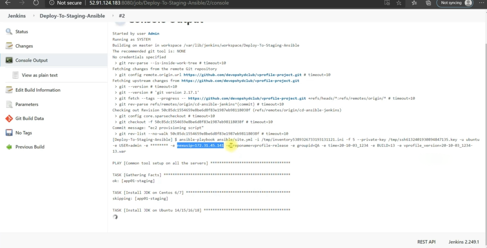
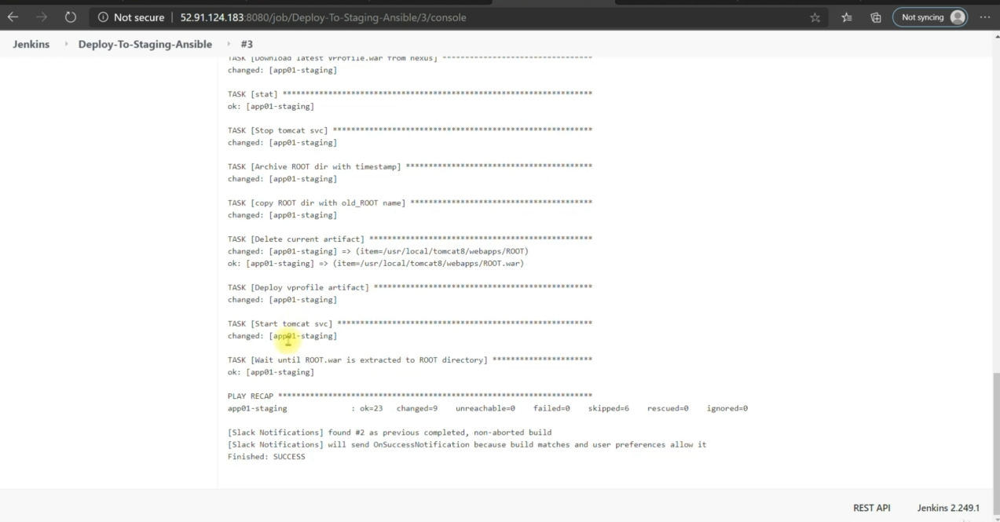

# Continuous Delivery Pipeline using Jenkins and Ansible

This project demonstrates how to automate the **Continuous Delivery (CD)** of a Java-based web application using **Jenkins** and **Ansible**. The app is built using Maven, and deployed on a remote AWS EC2 server through an Ansible playbook.

---

# Tools Used

- Jenkins (CI/CD server)
- Ansible (Configuration Management)
- AWS EC2 (App server)
- Git (Source Code)
- Maven (Build tool)
- Tomcat (Java app server)
- Slack (optional for notifications)

---

## Screenshots

## ✅ Jenkins Job Build List

## ✅ Jenkins Console Log

## ✅ Ansible Deployment to Staging

## ✅ SonarQube Code Analysis

## ✅ Java App Login Page

## ✅ RabbitMQ Management Console

## ✅ Memcached Status Page

## Learning Outcome

- Automated application delivery using Jenkins and Ansible
- Created Ansible playbooks to deploy Java apps to EC2
- Integrated Jenkins with Git, Maven, and remote servers
- Managed SSH-based deployments with inventory files and private keys
- Used Tomcat to host Java WAR files after every successful build

